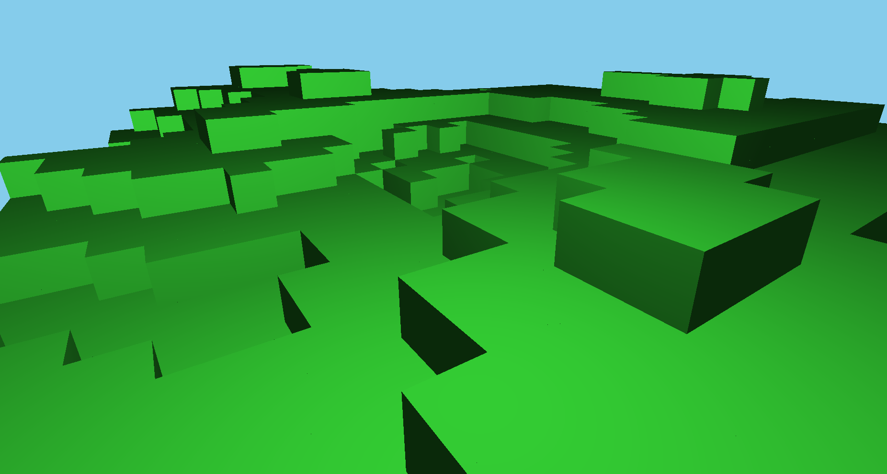

# 🟫 Magma Voxel Engine

OpenGL voxel sandbox. FPS camera, block collision, terrain via Perlin noise. Shoot voxels, render projectiles.Adding more features, like chunks for large scale worlds and mesh optimization as well as physics simulation.
With Modern AI Tools it is easier to setup a modern CPP Project and OpenGL libs to work on the same. Hope you like this project!

Note:
Traditionally, voxels have lower performance than polygons because they require significantly more memory and computational power to represent and render 3D objects. While polygons only store surface geometry, making them highly efficient and well-suited to the hardware acceleration provided by modern GPUs, voxels represent entire volumes—including empty or hidden spaces—which dramatically increases memory usage. Rendering voxels also typically involves generating polygon meshes on the fly or using computationally intensive techniques like raycasting, both of which are less optimized than the standard polygon pipeline. As a result, real-time voxel graphics often struggle with scalability and efficiency compared to polygon-based graphics, especially at higher resolutions or with large, complex scenes.

Voxels are particularly well-suited for applications that require real-time editing, destructible environments, or volumetric effects. Unlike polygons, voxels make it easy to add, remove, or modify material dynamically, and are ideal for representing complex internal structures, terrain with caves or overhangs, and volumetric phenomena like smoke or fluids. This makes them a strong choice for sandbox games, scientific visualization, and simulations where full 3D data is needed.

---

## 🎮 Preview




---

## 🔧 Features

- Procedural terrain (Perlin noise)
- WASD + mouse camera
- Gun rendering in screen space
- Projectile system with voxel collision
- Distance + frustum + face culling for perf
- Minimal design, extendable

---

## 🗂️ Folder Structure

<pre> ```bash . ├── shaders/ │ ├── cube.vert │ └── cube.frag ├── pics/ │ ├── main_view.png  ├── src/ │ ├── main.cpp │ ├── camera.h │ ├── cube_renderer.h │ ├── voxel_world.h │ ├── voxel_utils.h │ ├── shader.h │ └── particle.h └── README.md ``` </pre>

---

## ⚙️ Architecture

### 🚀 main.cpp
- Initializes OpenGL, sets up window and input
- Handles update + render loop
- Gun drawn in screen space (no camera translation)

### 🧱 VoxelWorld
- Stores voxels in `unordered_map<ivec3, Voxel>`
- Generates terrain using Perlin noise
- Only draws visible, nearby blocks

### 🧊 CubeRenderer
- Renders cubes using a single VAO
- Uses model/view/projection shader uniforms


### 💥 Projectile
- Spawned from camera front
- Destroys voxel on impact
- Uses manual collision check with rounded voxel positions

---

## 🎮 Controls

| Action      | Key         |
|-------------|-------------|
| Move        | W / A / S / D |
| Look        | Mouse       |
| Shoot       | Left Click  |
| Exit        | ESC         |

---

## 🛠️ Build

**Dependencies**: GLFW, GLAD, GLM, stb

```bash
git clone <repo>
mkdir build && cd build
cmake ..
make
./MagmaVoxel

Notes

    Terrain is scaled noise: stb_perlin_noise3(...)

    Voxel deletion = setting .active = false

    Camera follows standard FPS style (yaw-pitch)

    Gun doesn't move with player position, only rotation

    Cull:

        Far voxels (distSq > threshold)

        Fully surrounded blocks

        Outside frustum via bounding check

📄 License

MIT — use it however, build wild stuff.